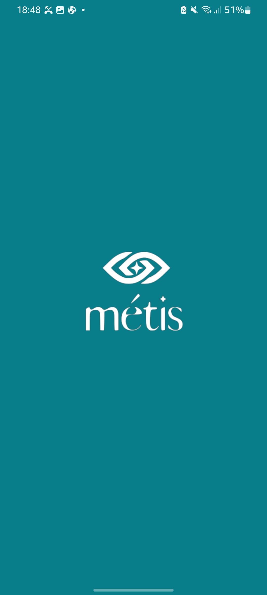
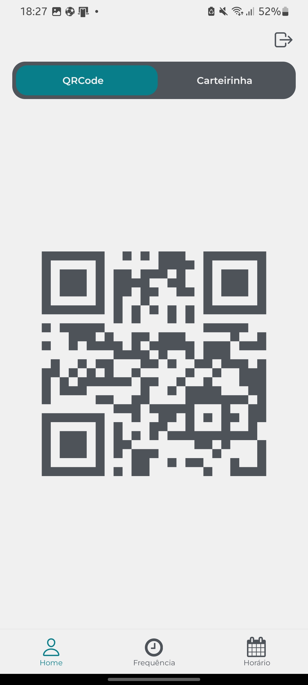
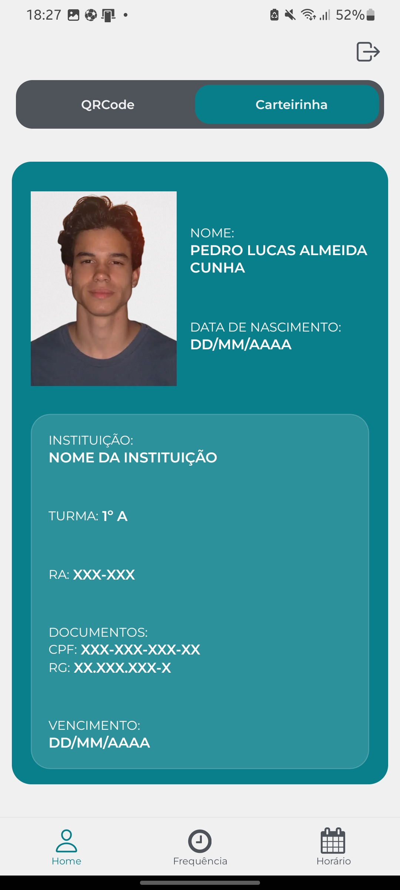
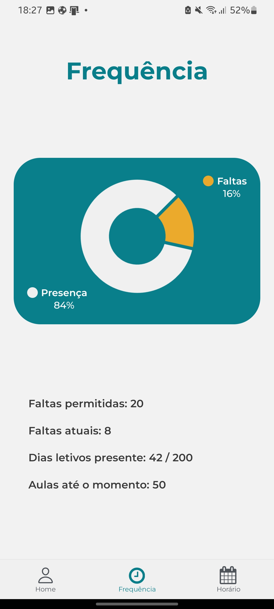
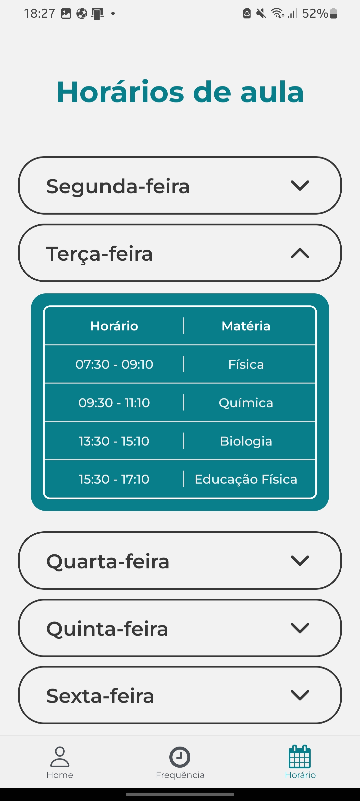

# Métis

## 🚀 Tecnologias Utilizadas


## 📱 Sobre o Projeto

Projeto frontend de aplicativo escolar.

## 📸 Screenshots

<table>
  <tr>
  <td align="center">
      <br/>
      <strong>Splash</strong>
    </td>
    <td align="center">
      <br/>
      <strong>Tela de Login</strong>
    </td>
    <td align="center">
      <br/>
      <strong>QRCode</strong>
    </td>
  </tr>
  <tr>
  <td align="center">
      <br/>
      <strong>Carteirinha</strong>
    </td>
    <td align="center">
      <br/>
      <strong>Frequência</strong>
    </td>
    <td align="center">
      <br/>
      <strong>Horário</strong>
    </td>
  </tr>
</table>

## 🛠️ Como Executar

1. Clone o repositório
   ```bash
   git clone https://github.com/pedroviscz/metis_frontend
   ```

2. Instale as dependências
   ```bash
   npm install
   ```

3. Inicie o aplicativo
   ```bash
   npx expo start
   ```

## 📱 Como Testar

- **Expo Go**: Escaneie o QR code com o aplicativo Expo Go
- **Emulador**: Pressione 'a' para abrir no Android ou 'i' para iOS
- **Web**: Pressione 'w' para abrir no navegador

## 🔗 Links Úteis

- [APK para download](https://expo.dev/artifacts/eas/pQXd2xmhL2q68rVjdnbMDk.apk)

## 🤝 Contribuição

Contribuições são bem-vindas! Sinta-se à vontade para abrir issues e pull requests.

## 📄 Licença

Este projeto está sob a licença MIT License.

## 👥 Colaboradores

<div align="center">
  <a href="https://github.com/MarihTavares" target="_blank">
    
  </a>
  
  <a href="https://github.com/WalacePrado" target="_blank">
    
  </a>
<div align="center">
